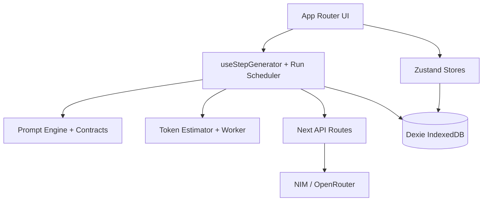
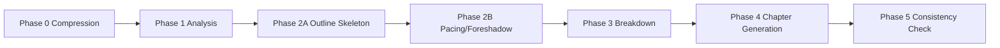

# ARCHITECTURE.md

## System Summary

Novel Continuation Studio is a Next.js 16 + React 19 application with local-first persistence (Dexie/IndexedDB), phase-based generation orchestration, and provider-routed LLM execution (NIM/OpenRouter).

## High-Level Topology

## Phase Pipeline (0 to 5)

## Runtime Layers

1. Presentation
- `app/`, `components/`
- Workflow controls, output panels, settings UI, lorebook UI

2. Application Orchestration
- `hooks/useStepGenerator.ts`
- `hooks/useWorkflowOrchestrator.ts`
- `store/useRunSchedulerStore.ts`

3. Prompt and Validation
- `lib/prompts.ts`
- `lib/prompt-engine.ts`
- `lib/prompt-section-contracts.ts`
- `lib/section-retry.ts`
- `lib/outline-phase2.ts`
- `lib/analysis-output.ts`

4. Provider and Transport
- `lib/llm-client.ts`
- `app/api/openrouter/generate/route.ts`
- `app/api/nim/generate/route.ts`

5. Persistence
- `lib/db.ts`
- `store/useNovelStore.ts`
- `store/useSettingsStore.ts`

## Key Design Decisions

- Local-first: all user data is in IndexedDB.
- Phase split over single giant prompt to improve control and debuggability.
- Prompt contracts + section retry for structured outputs.
- Token preflight gate to stop likely context-overflow requests.
- Internal secret header gate on API routes for non-public deployment posture.

## Critical Invariants

- Phase 2A/2B output is skeleton-only, not prose draft.
- Phase 2B reads Phase 2A sanitized output.
- Analysis can expose both detailed and executive summary blocks.
- Required section headers are validated for contract-enabled prompts.
- Auto-resume is bounded by a hard max round count.
- Requests near context budget threshold are blocked preflight.

## Non-Goals (Current)

- Multi-tenant production auth/authorization.
- Cloud persistence and cross-device sync.
- Mobile-first UX parity.

## Related Docs

- `docs/DESIGN.md`
- `docs/RELIABILITY.md`
- `docs/SECURITY.md`
- `docs/generated/db-schema.md`

